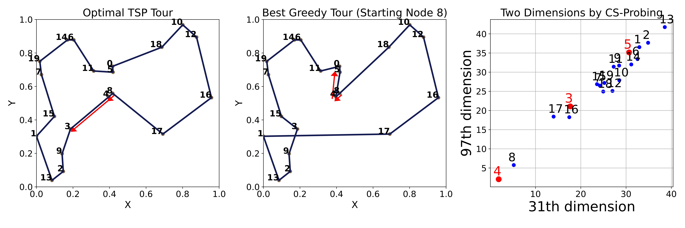

# Probing Neural Combinatorial Optimization Models

📢 Our paper "[_Probing Neural Combinatorial Optimization Models_](https://arxiv.org/abs/2510.22131)" has been accepted to _NeurIPS 2025_ as 🌟**spotlight**🌟. 

## 📖 Paper Summary  
We present the first systematic interpretation of black-box **Neural Combinatorial Optimization (NCO) models**, proposing **CS-Probing** to reveal multi-level knowledge encoding, diverse inductive biases in model representations, and potential reasons behind varying generalization capabilities across different models. Based on probing insights, we improve model generalization with minimal code changes, demonstrating the practical value of interpretability tools for NCO research.

## 📊 Main Results

- **Different Inductive Biases & Generalization**
  **Different NCO models exhibit distinct inductive biases in their learned representations.** CS-Probing reveals that prevalent NCO models encode **different inductive biases** and exhibit **distinct behaviors when generalizing**.  

<p align="center">
  
</p>

- **Key Embedding Dimensions in Abstract Space of LEHD**   
  **Visualization of model decision space in two key embedding dimensions.** By identifying critical two dimensions in the high-dimensional representation space through CS-Probing, we extract and visualize **two key dimensions** that capture essential **decision-making patterns**, making the model's internal decision space **interpretable** and **observable**. 

  


## 📂 Codes

- **1_data_gen**  
  Code for generating and collecting routing instance datasets.  

- **2_NCO_emb_extract**  
  Code for extracting embeddings from [POMO](https://github.com/yd-kwon/POMO) and [LEHD](https://github.com/CIAM-Group/NCO_code/tree/main/single_objective/LEHD) models.  

- **3_probing_exp**  
  Code for running probing experiments, including the implementation of **CS-Probing** and visualization of results.  

- **4_LEHD_regularization**  
  Training code for the [LEHD](https://github.com/CIAM-Group/NCO_code/tree/main/single_objective/LEHD) regularization experiment (as used in the *Practical Implications* subsection in our [paper](https://arxiv.org/abs/2510.22131)).  


## 📚 Reference  

If you find this useful, please consider citing our paper:  

```bibtex
@article{zhang2025probing,
  title={Probing Neural Combinatorial Optimization Models},
  author={Zhang, Zhiqin and Ma, Yining and Cao, Zhiguang and Lau, Hoong Chuin},
  journal={Advances in Neural Information Processing Systems},
  year={2025}
}
